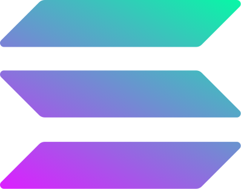

# Coloured Icons

Sample icons

 
                

Throw in a CDN and watch the magic happen! Don't bother with all that `npm` stuff; just use the easy `<i>` tag. It's a bunch of logos from different brands and tech stacks. You can use these awesome icons in your projects without ever dealing with any downloads

## Features

- Super easy integration into your web projects using the `<i>` tag
- Change the size of icons just like Font Awesome icons
- Flip the colors of icons using the `ci-invert` class

## Installation

To use the Coloured Icons Library, simply add the following CDN link to your HTML file (Be careful with the release versions, they might include breaking changes):

```
<link
  rel="stylesheet"
  href="https://cdn.jsdelivr.net/gh/dheereshagrwal/coloured-icons@1.8.4/src/app/ci.min.css"
/>
```

Use the below one for latest

```
<link
  rel="stylesheet"
  href="https://cdn.jsdelivr.net/gh/dheereshagrwal/coloured-icons@master/src/app/ci.min.css"
/>
```

## Usage

```
<i class="ci ci-spotify ci-2x"></i>
```


```
<i class="ci ci-git ci-md"></i>
```


```
<i class="ci ci-nuxtjs ci-5x"></i>
```


```
<i class="ci ci-azure ci-sm"></i>
```


```
<i class="ci ci-redis ci-3x"></i>
```


## Inverting the color

If you want to invert the color for some reason, just add `ci-invert`.

```
<i class="ci ci-postman ci-2x ci-invert"></i>
```

## Sizing

I used the same sizing style used by Font Awesome:

`ci-2xs` `ci-xs` `ci-sm` `ci-md` `ci-lg` `ci-xl` `ci-2xl`


`ci-1x` `ci-2x` `ci-3x` `ci-4x` `ci-5x` `ci-6x` `ci-7x` `ci-8x` `ci-9x` `ci-10x`

         

For more details about the sizing, you can refer to this [Font Awesome Icon Size Documentation](https://fontawesome.com/docs/web/style/size)

## Dark and Light icons

By default, the `ci-nextjs` will refer to the dark version of the logo which means that you have to use it on a light background, you can also write `ci-nextjs-dark` for the same.
Just don't write `ci-nextjs ci-dark`, dark is not some class that can be applied to coloured icons.

`ci-nextjs`


Similarly, `ci-nextjs-light` refers to the light version of the icon which means that you have to use it on a dark background.
Note that not every brand has dark and/or light icons


## Horizontal (Inline), Vertical (Stacked), and Wordmark icons

`ci-infura-wordmark` refers to the wordmark icon of the brand. If you don't understand what it means, you can refer to this [Infura Press Kit](https://www.infura.io/presskit)


`ci-whatsapp-horizontal` or `ci-whatsapp-inline` refers to the horizontal/inline icon with the logo on the left and wordmark on the right.


Similarly, `ci-whatsapp-vertical` or `ci-whatsapp-stacked` refers to the vertical/stacked icon with the logo on top and wordmark on the bottom. If you wish to know more about the naming convention, refer to this [Alan Brand Assets](https://alan.app/brand-assets/).

Note that not every brand has horizontal and/or vertical icons.


## Second version

Some icons have a second version of them provided which is a darker shade of the original such as

`ci ci-mongodb2`


`ci ci-mongodb`


## Contribution

The code is very lightweight and dead simple; there is nothing fancy going on.
Please note that we use `pnpm` for faster builds.

### Guidelines for naming

`logo -> {company}.svg`

`wordmark (text) -> {company-wordmark}.svg`

`logo + wordmark -> {company-horizontal}.svg`

`logo + vertical logo -> {company-vertical}.svg`

If you want me to add an icon that is missing or have some suggestions, just raise an issue.

## Scripts before deployment

## Development Scripts

During development, run the following scripts:

-   `pnpm run dev`: Generates automated files. This script is also executed during the push process by GitHub Actions.

## License

The Coloured Icons Library is licensed under the MIT License. Please review the license file for more details.

## Contact 👋🏻

[Visit my personal website](https://dheereshagrwal.vercel.app)
